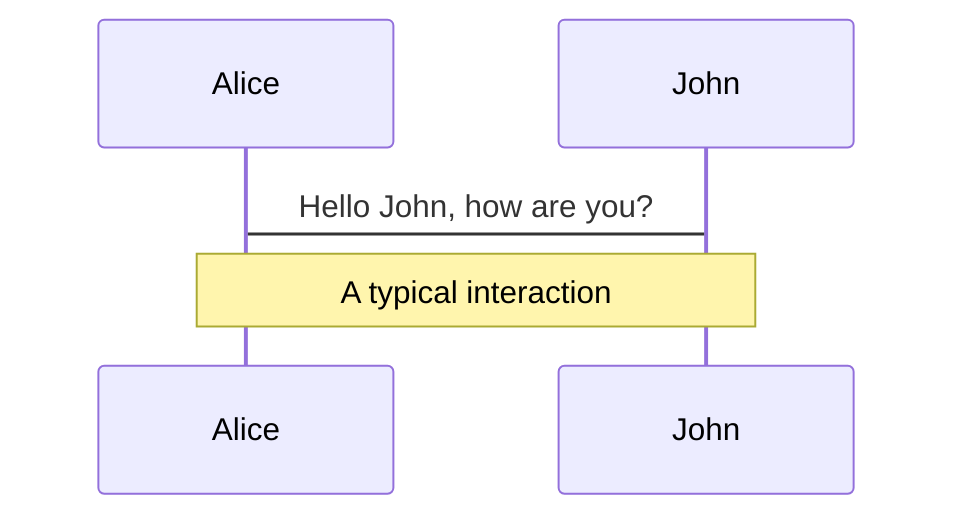
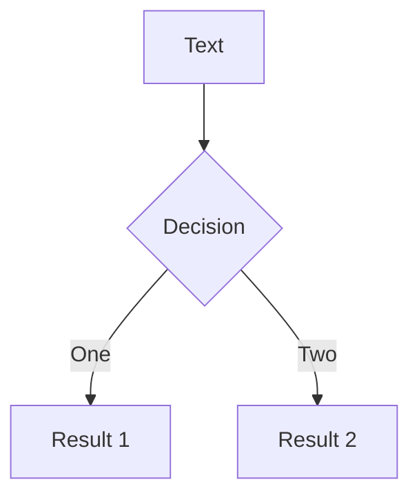
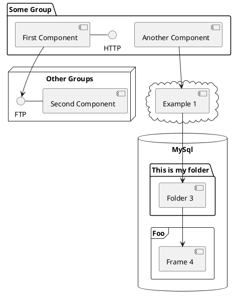

---
# try also 'default' to start simple
theme: seriph
# random image from a curated Unsplash collection by Anthony
# like them? see https://unsplash.com/collections/94734566/slidev
background: https://source.unsplash.com/collection/94734566/1920x1080
# apply any windi css classes to the current slide
class: 'text-center'
# https://sli.dev/custom/highlighters.html
highlighter: shiki
# show line numbers in code blocks
lineNumbers: false
# some information about the slides, markdown enabled
info: |
  ## Slidev Starter Template
  Presentation slides for developers.

  Learn more at [Sli.dev](https://sli.dev)
# persist drawings in exports and build
drawings:
  persist: false
---

# Node.js 命令行工具开发讲习班

@meathill

<div class="pt-12">
  <span @click="$slidev.nav.next" class="px-2 py-1 rounded cursor-pointer" hover="bg-white bg-opacity-10">
    Let's go <carbon:arrow-right class="inline"/>
  </span>
</div>

<div class="abs-br m-6 flex gap-2">
  <button @click="$slidev.nav.openInEditor()" title="Open in Editor" class="text-xl icon-btn opacity-50 !border-none !hover:text-white">
    <carbon:edit />
  </button>
  <a href="https://github.com/meathill/my-workshop" target="_blank" alt="GitHub"
    class="text-xl icon-btn opacity-50 !border-none !hover:text-white">
    <carbon-logo-github />
  </a>
</div>

<!--
大家好，欢迎参加今天的线上实战讲习班。

今天要教授的内容是：使用现成的 npm 包，经过封装制成我们自己的命令行工具。
-->

---

# 教学目标

经过本次 workshop，大家将学到：

- 📝 **安装 node.js**
- 🎨 **创建 node.js 项目**
- 🧑‍💻 **使用 JavaScript 开发命令行工具**
- 🤹 **使用现成的 npm 包**
- 🎥 **在 node.js 中使用 ESM**
- 📤 **将自己的包发布到 npm**

<br>
<br>

召集文：[免费线上讲习班：使用 node.js 开发命令行工具](https://blog.meathill.com/share/online-workshop-developing-command-line-tools-with-nodejs.html)

<!--
学会上面几点，大家就可以使用 npm 上浩如烟海的开源仓库，封装成自己的工具。

一方面可以加强自己的工作效率，另一方面也可以早日参与开源项目的建设。从各个方面来讲都是很大的提升。
-->

<style>
h1 {
  background-color: #2B90B6;
  background-image: linear-gradient(45deg, #4EC5D4 10%, #146b8c 20%);
  background-size: 100%;
  -webkit-background-clip: text;
  -moz-background-clip: text;
  -webkit-text-fill-color: transparent;
  -moz-text-fill-color: transparent;
}
</style>

---

# 安装 Node.js

在 Windows/macOS/Linux 下安装 Node.js。

### 推荐方案

|     |     |
| --- | --- |
| Windows | 前往 [nodejs.org](https://nodejs.org)，下载安装包 |
| macOS | 安装 [Homebrew](https://brew.sh)，`brew install node@16` |
| Linux | 安装官方预编译包，[参考](https://nodejs.org/en/download/package-manager/) |
| nvm | 😠 不推荐 |

<!--
我建议大家经常更新电脑上的各种工具和软件，以便能够获得最新的功能、同时修补各种问题。

一般来说，Homebrew、apt 等工具都会一次性更新所有软件。所以我一般不推荐 nvm。
-->

---
layout: image-right
image: https://source.unsplash.com/collection/94734566/1920x1080
---

# 创建 node.js 项目

使用命令行，输入以下命令：

```bash {all|1-2|3-7|9-11|all}
# 创建 npm 项目，这次不需要
npm init project

# 创建目录
mkdir myrar

cd myrar

# 创建 package.json
npm init -y
```

---

# `package.json` 结构

项目中的关键属性。

<div grid="~ cols-2 gap-4" class="mb-16">
<div>

* 项目名称：`name`
* 版本号：`version`
* 入口文件：`main`
* 执行文件和命令：`bin`
* 协议：`license`
* 依赖：`dependencies`
* 模块类型：`module`

</div>
<div>

```json {all|2|3|4|5-7|8|9-12|13|all}
{
  "name": "@meathill/unrar",
  "version": "0.1.0",
  "main": "index.js",
  "bin": {
    "unrar": "./index.js"
  },
  "license": "MIT",
  "dependencies": {
    "unrar-promise": "^3.0.0-1",
    "yargs": "^17.3.1"
  },
  "type": "module"
}
```

</div>
</div>

扩展阅读：[package.json 文档](https://docs.npmjs.com/cli/v8/configuring-npm/package-json)

<!--
这里我只介绍比较关键的属性，想了解更全面的信息，请阅读官方文档。
-->

---

# [unrar-promise](https://www.npmjs.com/package/unrar-promise) 仓库介绍

unrar-promise 是一个 npm 包，用于解压缩 rar 文件。它的功能非常简单。

<div grid="~ cols-2 gap-2">

安装

使用

```bash
npm i unrar-promise
```

```bash
import {unrar, list} from 'unrar-promise';

await unrar('archive.rar', './output');
```
</div>

---
preload: false
---

# Animations

Animations are powered by [@vueuse/motion](https://motion.vueuse.org/).

```html
<div
  v-motion
  :initial="{ x: -80 }"
  :enter="{ x: 0 }">
  Slidev
</div>
```

<div class="w-60 relative mt-6">
  <div class="relative w-40 h-40">
    
    
    
  </div>

  <div
    class="text-5xl absolute top-14 left-40 text-[#2B90B6] -z-1"
    v-motion
    :initial="{ x: -80, opacity: 0}"
    :enter="{ x: 0, opacity: 1, transition: { delay: 2000, duration: 1000 } }">
    Slidev
  </div>
</div>

<!-- vue script setup scripts can be directly used in markdown, and will only affects current page -->
<script setup lang="ts">
const final = {
  x: 0,
  y: 0,
  rotate: 0,
  scale: 1,
  transition: {
    type: 'spring',
    damping: 10,
    stiffness: 20,
    mass: 2
  }
}
</script>

<div
  v-motion
  :initial="{ x:35, y: 40, opacity: 0}"
  :enter="{ y: 0, opacity: 1, transition: { delay: 3500 } }">

[Learn More](https://sli.dev/guide/animations.html#motion)

</div>

---

# LaTeX

LaTeX is supported out-of-box powered by [KaTeX](https://katex.org/).

<br>

Inline $\sqrt{3x-1}+(1+x)^2$

Block
$$
\begin{array}{c}

\nabla \times \vec{\mathbf{B}} -\, \frac1c\, \frac{\partial\vec{\mathbf{E}}}{\partial t} &
= \frac{4\pi}{c}\vec{\mathbf{j}}    \nabla \cdot \vec{\mathbf{E}} & = 4 \pi \rho \\

\nabla \times \vec{\mathbf{E}}\, +\, \frac1c\, \frac{\partial\vec{\mathbf{B}}}{\partial t} & = \vec{\mathbf{0}} \\

\nabla \cdot \vec{\mathbf{B}} & = 0

\end{array}
$$

<br>

[Learn more](https://sli.dev/guide/syntax#latex)

---

# Diagrams

You can create diagrams / graphs from textual descriptions, directly in your Markdown.

<div class="grid grid-cols-3 gap-10 pt-4 -mb-6">







</div>

[Learn More](https://sli.dev/guide/syntax.html#diagrams)


---
layout: center
class: text-center
---

# Learn More

[Documentations](https://sli.dev) · [GitHub](https://github.com/slidevjs/slidev) · [Showcases](https://sli.dev/showcases.html)
